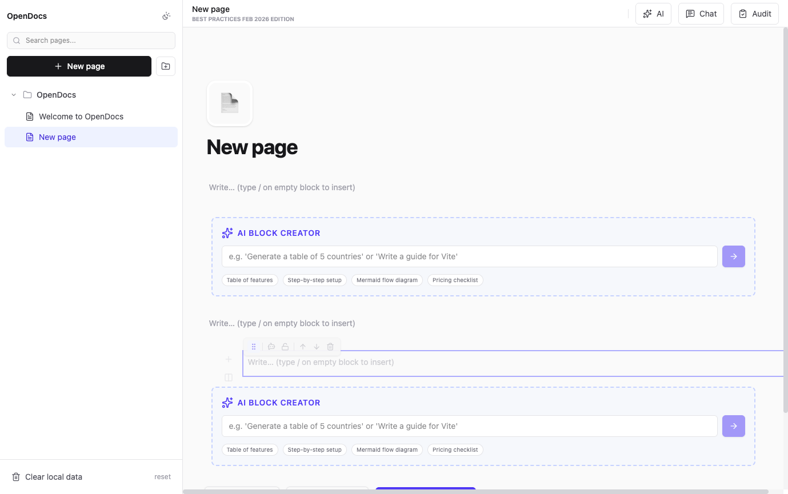

# OpenDocs

<div align="center">

[](https://github.com/opendocs/opendocs)
[](./LICENSE)
[]()
[](https://www.typescriptlang.org/)
[](https://react.dev/)
[](https://tailwindcss.com/)

**The Open Source Operating System for Documentation, Relational Databases & Visual Workflows**

*Besser als Notion + Linear + Plane*

[Quick Start](#-quick-start) • [Features](#-features) • [Tech Stack](#-tech-stack) • [Documentation](#-documentation) • [Contributing](#-contributing)

</div>

---



## 📝 Description

OpenDocs is a **client-first** documentation platform with AI-powered block editing, real relational databases (6 views), visual n8n workflow orchestration, and object-based whiteboarding. Built with **Best Practices Februar 2026**.

---

## ⚡ Quick Start

```bash
# 1. Clone & Install
git clone https://github.com/opendocs/opendocs.git && cd opendocs && npm install

# 2. Configure Environment
cp .env.example .env && nano .env

# 3. Launch
node server.js & npm run dev
```

**Access:** http://localhost:5173

---

## ✨ Features

| Feature | Description | Status |
|---------|-------------|--------|
| 🤖 **AI Prompt Block** | Create complex documentation structures via natural language | ✅ |
| 📊 **Real Databases** | 6 interactive views (Table, Kanban, Flow, Calendar, Timeline, Gallery) | ✅ |
| 🎯 **Per-Block AI Agent** | Context-aware transformations per block | ✅ |
| 🔗 **Visual n8n Orchestration** | Connect automation nodes visually | ✅ |
| 🎨 **Object-Based Whiteboard** | Drag DB entries onto infinite canvas | ✅ |
| 🔒 **Hard Locks (R2)** | Protect critical sections from editing | ✅ |
| 📱 **Responsive Design** | Mobile-ready with auto sidebar collapse | ✅ |
| 🌙 **Dark Mode** | System preference + localStorage persistence | ✅ |
| ⌨️ **Keyboard Shortcuts** | Ctrl+K (Palette), Ctrl+G (AI), Ctrl+J (Chat), Ctrl+B (Sidebar) | ✅ |
| ↩️ **Undo/Redo** | Full history support (50 entries) | ✅ |

---

## 🛠 Tech Stack

### Frontend
| Technology | Version | Purpose |
|------------|---------|---------|
| [React](https://react.dev/) | 19.2.3 | UI Framework |
| [TypeScript](https://www.typescriptlang.org/) | 5.9.3 | Type Safety |
| [Tailwind CSS](https://tailwindcss.com/) | 4.1.17 | Styling |
| [Vite](https://vitejs.dev/) | 7.2.4 | Build Tool |
| [Zustand](https://zustand-demo.pmnd.rs/) | 5.0.11 | State Management |
| [Framer Motion](https://www.framer.com/motion/) | 12.34.0 | Animations |
| [React Flow](https://reactflow.dev/) | 12.10.0 | Visual Workflows |
| [Excalidraw](https://excalidraw.com/) | 0.18.0 | Whiteboard |

### Backend
| Technology | Version | Purpose |
|------------|---------|---------|
| [Express](https://expressjs.com/) | 5.2.1 | API Server |
| [PostgreSQL](https://www.postgresql.org/) | - | Relational Database |
| [Supabase](https://supabase.com/) | 2.95.3 | Backend-as-a-Service |
| [n8n](https://n8n.io/) | - | Workflow Automation |

### AI Integration
| Provider | Model | Purpose |
|----------|-------|---------|
| [NVIDIA NIM](https://build.nvidia.com/) | moonshotai/kimi-k2.5 | Primary LLM |

---

## 📖 Documentation

| Document | Description |
|----------|-------------|
| [ARCHITECTURE.md](./ARCHITECTURE.md) | Technical architecture & layer model |
| [AGENTS-PLAN.md](./AGENTS-PLAN.md) | Chronological task system & session log |
| [REQUIREMENTS.md](./REQUIREMENTS.md) | Complete dependency list |
| [API-ENDPOINTS.md](./API-ENDPOINTS.md) | REST API reference |
| [API-OPENAPI.md](./API-OPENAPI.md) | OpenAPI specification |
| [SUPABASE.md](./SUPABASE.md) | Visual-relational data guide |
| [DEPLOYMENT.md](./DEPLOYMENT.md) | Production deployment |
| [TROUBLESHOOTING.md](./TROUBLESHOOTING.md) | Common issues & solutions |
| [ONBOARDING.md](./ONBOARDING.md) | Developer onboarding guide |

---

## 🧪 Testing

### Unit Tests (Vitest)
```bash
npm test                    # Run all tests
npm test -- --run           # CI mode
npm run test:coverage       # With coverage
```

### E2E Tests (Playwright)
```bash
npm run test:e2e            # Browser tests
```

| Area | Files | Status |
|------|-------|--------|
| Hooks | `src/hooks/__tests__/*.ts` | ✅ 8/8 Passing |
| E2E | `src/tests/e2e/*.spec.ts` | ✅ Ready |

---

## ⌨️ Keyboard Shortcuts

| Shortcut | Action |
|----------|--------|
| `Ctrl+K` | Command Palette |
| `Ctrl+G` | AI Panel |
| `Ctrl+J` | Chat |
| `Ctrl+B` | Toggle Sidebar |
| `Ctrl+Z` | Undo |
| `Ctrl+Shift+Z` | Redo |
| `Escape` | Close All |

---

## 📱 Responsive Breakpoints

| Breakpoint | Width | Devices |
|------------|-------|---------|
| xs | 0-639px | Mobile Phones |
| sm | 640-767px | Large Phones |
| md | 768-1023px | Tablets |
| lg | 1024-1279px | Laptops |
| xl | 1280-1535px | Desktops |
| 2xl | 1536px+ | Large Screens |

---

## 🔒 Security (Golden Rules)

- **R1:** No secrets in client code
- **R2:** Hard locks for critical areas
- **R3:** Read first, edit second
- **R4:** nanoid for all IDs

---

## 🤝 Contributing

1. Fork the repository
2. Create a feature branch: `git checkout -b feat/amazing-feature`
3. Commit changes: `git commit -m 'feat: add amazing feature'`
4. Push to branch: `git push origin feat/amazing-feature`
5. Open a Pull Request

See [CONTRIBUTING.md](./CONTRIBUTING.md) for detailed guidelines.

---

## 📄 License

This project is licensed under the MIT License - see the [LICENSE](./LICENSE) file for details.

---

## 🙏 Acknowledgments

Built with ❤️ using Best Practices Februar 2026.

---

<div align="center">

**[↑ Back to Top](#opendocs)**

</div>
